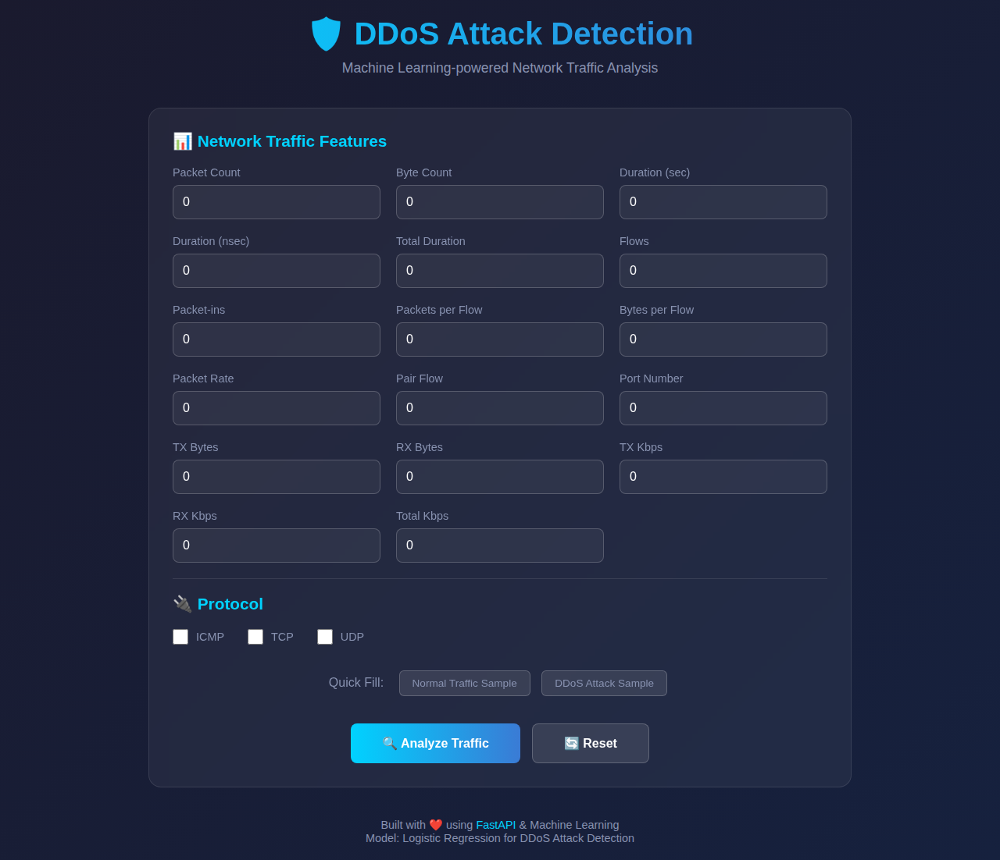

# **🚀 DDoS Attack Detection Using Logistic Regression**  
🔍 **A machine learning model to detect DDoS attacks using Logistic Regression.**  

---

## 📌 **Overview**  
This project implements a **DDoS Attack Detection System** using **Logistic Regression**. The trained model analyzes **network traffic** and classifies it as either **normal traffic** or a **DDoS attack** based on key network features.  

✅ **Algorithm:** Logistic Regression  
✅ **Model Format:** `ddos_logistic_regression.pkl`  
✅ **Prediction Script:** `ddos_attack_detection_using_logistic_regression.py`  

---

## 📂 **Project Structure**  
```bash
📁 DDoS-Attack-Detection
│── 📜 README.md                  # Project description (this file)
│── 📜 ddos_logistic_regression.pkl # Trained model file
│── 📜 ddos_attack_detection_using_logistic_regression.py # Python script for DDoS detection
│── 📜 api.py                     # FastAPI backend for DDoS detection
│── 📜 requirements.txt           # Python dependencies
│── 📁 static/
│   ├── 📜 index.html             # JavaScript frontend UI
│   └── 📷 screenshot.png         # Web interface screenshot
```

---

## 🔧 **Installation & Setup**  

### **🔹 Step 1: Clone the Repository**  
```bash
git clone https://github.com/HassanCodesit/DDOS-attack-detection-using-logistic-regression
```

### **🔹 Step 2: Install Dependencies**  
```bash
pip install -r requirements.txt
```

### **🔹 Step 3: Run the Detection Script**  
```bash
python ddos_attack_detection_using_logistic_regression.py
```

---

## 🌐 **Web Application (FastAPI + JavaScript)**

This project includes a **FastAPI backend** with a **JavaScript frontend** for easy web-based DDoS detection.

### **📸 Screenshot**



### **🔹 Start the Web Server**
```bash
uvicorn api:app --host 0.0.0.0 --port 8000
```

Then open your browser and navigate to: `http://localhost:8000`

### **🔹 API Endpoints**

| Endpoint | Method | Description |
|----------|--------|-------------|
| `/` | GET | Serves the web frontend |
| `/health` | GET | Health check endpoint |
| `/predict` | POST | Predict DDoS attack from network traffic data |

### **🔹 Example API Request**
```bash
curl -X POST http://localhost:8000/predict \
  -H "Content-Type: application/json" \
  -d '{
    "pktcount": 50000,
    "bytecount": 5000000,
    "dur": 1,
    "flows": 500,
    "pktrate": 50000,
    "Protocol_UDP": 1
  }'
```

### **🔹 Example Response**
```json
{
  "prediction": 1,
  "label": "DDoS Attack Detected",
  "confidence": "100.00%"
}
```

---

## 🚀 **How It Works?**  
1️⃣ **Loads the trained model (`ddos_logistic_regression.pkl`).**  
2️⃣ **Takes network traffic data as input.**  
3️⃣ **Predicts whether the traffic is normal or a DDoS attack.**  

---

## 📊 **Run on Google Colab**  
You can also run this project directly on **Google Colab**:  

[](https://colab.research.google.com/drive/1gygTiLNHlBu1e9sOj2LC8EYtCp8tF6Zb?usp=sharing)  


